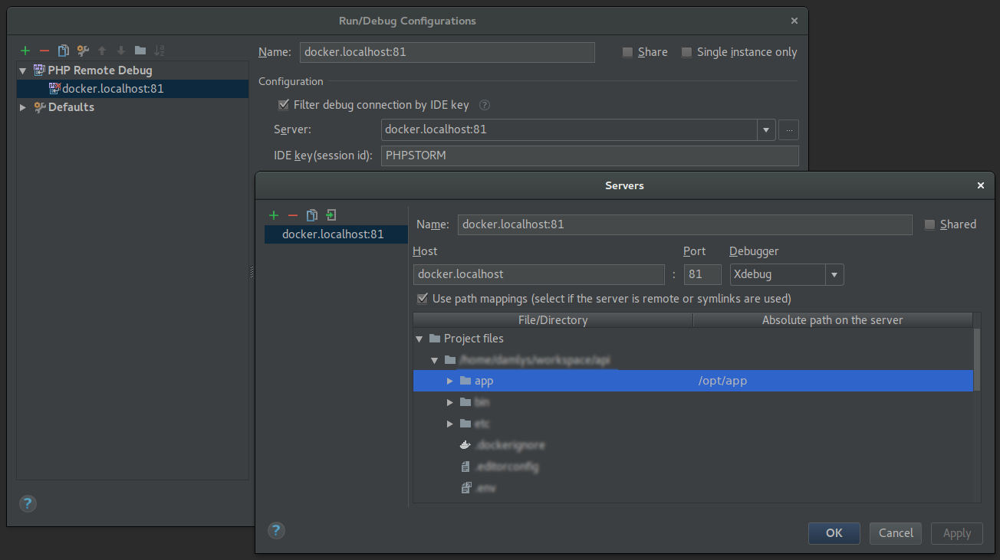

[<-- Back to main section](../README.md)

# PHP Debugging

## PHPStorm configuration




## Chrome plugin

https://chrome.google.com/webstore/detail/xdebug-helper/eadndfjplgieldjbigjakmdgkmoaaaoc


## Callgrind application

https://kcachegrind.github.io/html/Home.html

##### Linux/Ubuntu

```
$ sudo apt install kcachegrind
```
 
##### MacOS

```
$ brew install qcachegrind
```

##### Windows

https://sourceforge.net/projects/qcachegrindwin/
