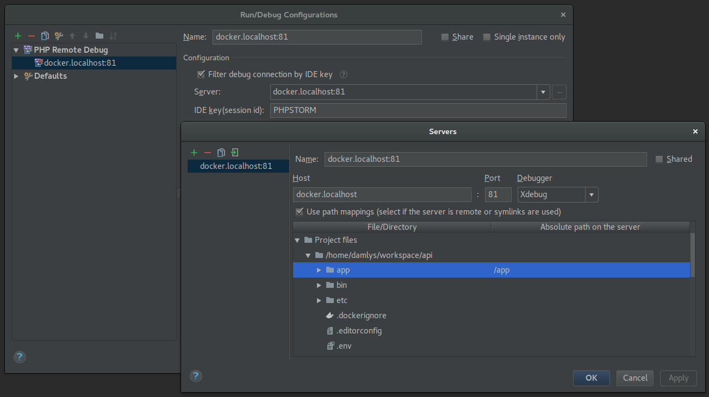

[<-- Back to main section](../README.md)

# PHP Debugging

## Xdebug

https://xdebug.org/

Xdebug is not installed in the app image by default. 
To do it run `make install-xdebug`.
This is required after each container recreation.

## PHPStorm

## Chrome

https://chrome.google.com/webstore/detail/xdebug-helper/eadndfjplgieldjbigjakmdgkmoaaaoc

## KCacheGrind

https://kcachegrind.github.io/html/Home.html

##### Linux/Ubuntu

`sudo apt install kcachegrind`
 
##### MacOS

`brew install qcachegrind`

##### Windows

https://sourceforge.net/projects/qcachegrindwin/
