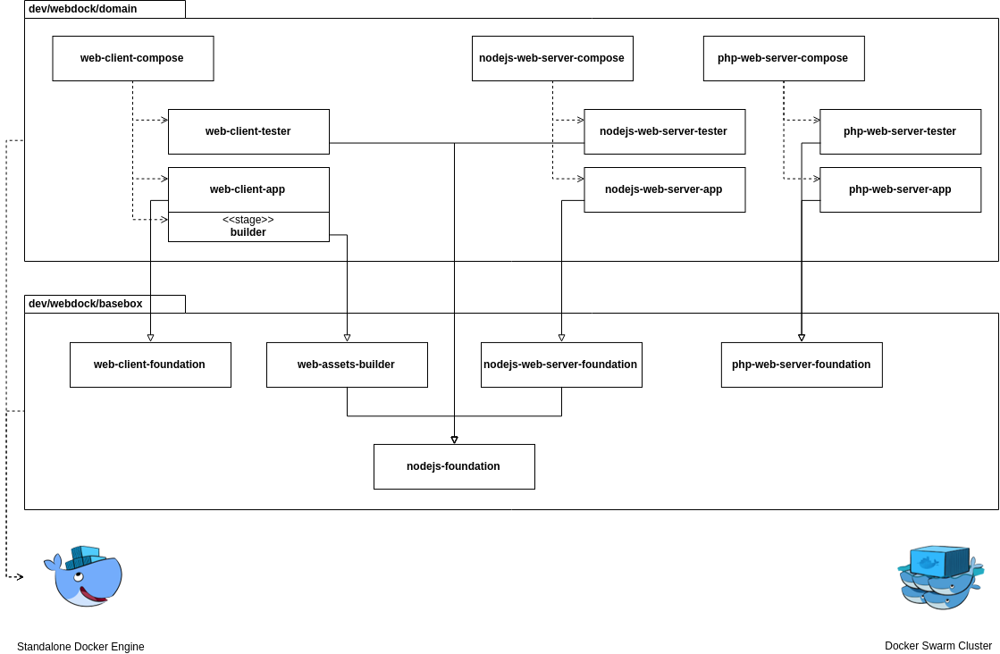

WebDock
===

Monorepo Docker starter for web applications



## Table of contents

1. [Requirements](#requirements)
1. [Getting started](#getting-started)
1. [Useful links](docs/Useful-links.md)
1. [Used Docker images](docs/Used-Docker-images.md)
1. [PHP debugging tools](docs/PHP-debugging-tools.md)

## Requirements

Following software is required to work with this repository:

```
$ docker version 
Client:
 Version:           18.09.3
 API version:       1.39
 Go version:        go1.10.8
 Git commit:        774a1f4
 Built:             Thu Feb 28 06:53:11 2019
 OS/Arch:           linux/amd64
 Experimental:      false

Server: Docker Engine - Community
 Engine:
  Version:          18.09.3
  API version:      1.39 (minimum version 1.12)
  Go version:       go1.10.8
  Git commit:       774a1f4
  Built:            Thu Feb 28 05:59:55 2019
  OS/Arch:          linux/amd64
  Experimental:     false

$ docker-compose version
docker-compose version 1.23.2, build 1110ad0
docker-py version: 3.7.0
CPython version: 2.7.15rc1
OpenSSL version: OpenSSL 1.1.0g  2 Nov 2017
```

Check if Docker daemon works correctly:

```
$ docker container run --rm hello-world

Hello from Docker!
This message shows that your installation appears to be working correctly.

...
```

Note: `docker-compose` command operates on
standalone Docker Engine. It does not require
Docker Swarm mode:

```
$ docker info --format="{{.Swarm.LocalNodeState}}"
inactive
```

## Getting started

Go to your workspace:

```
$ cd ~/workspace
```

Export few envs:

```
$ export TLD="org" ORGANIZATION_NAME="my-organization" PROJECT_NAME="my-project"
```

And create new project with WebDock:

```
$ git clone git@github.com:damlys/webdock.git ${PROJECT_NAME} \
  && cd ${PROJECT_NAME} \
  && rm -rfv \
    .git \
    CHANGELOG.md \
    LICENSE.md \
  && mkdir -p ${TLD}/${ORGANIZATION_NAME} \
  && cp -rv dev/webdock/* ${TLD}/${ORGANIZATION_NAME} \
  && grep -rl webdock ${TLD}/${ORGANIZATION_NAME} | xargs sed -i "s/webdock/${PROJECT_NAME}/g" \
  && echo "Delete ./dev/webdock/*? (y/n)" \
  && rm -rfIv \
    dev/webdock \
    init-webdock.bash \
  && echo "Delete top-level documentation? (y/n)" \
  && rm -rfIv \
    docs \
    README.md \
  && git init \
  && git add . \
  && git commit -m "Initial commit (WebDock v0.14 <https://github.com/damlys/webdock>)"
```
