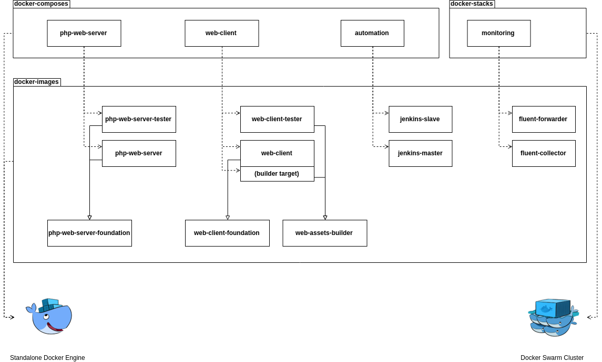

WebDock
===

WebDock is a monorepo Docker starter for PHP server
and web client applications.

## Table of contents

1. [Getting started](#getting-started)
1. [Useful links](Documentation/Useful-links.md)
1. [Used Docker images](Documentation/Used-Docker-images.md)
1. [PHP Debugging](Documentation/PHP-Debugging.md)

## Getting started



### Requirements

Following software is required to work with this repository:

```
$ docker version
Client:
 Version:           18.09.0
 API version:       1.39
 Go version:        go1.10.4
 Git commit:        4d60db4
 Built:             Wed Nov  7 00:49:01 2018
 OS/Arch:           linux/amd64
 Experimental:      false

Server: Docker Engine - Community
 Engine:
  Version:          18.09.0
  API version:      1.39 (minimum version 1.12)
  Go version:       go1.10.4
  Git commit:       4d60db4
  Built:            Wed Nov  7 00:16:44 2018
  OS/Arch:          linux/amd64
  Experimental:     false

$ docker-compose version
docker-compose version 1.23.1, build b02f1306
docker-py version: 3.5.0
CPython version: 3.6.7
OpenSSL version: OpenSSL 1.1.0f  25 May 2017
```

Check if Docker daemon works correctly:

```
$ docker container run --rm hello-world

Hello from Docker!
This message shows that your installation appears to be working correctly.

...
```

Check if Docker Swarm mode is enabled:

```
$ docker info --format="{{.Swarm.LocalNodeState}}"
active
```

### Prerequisites

Login to Docker registry:

```
$ docker login --username=damlys
```

Create volumes for package managers cache:

```
$ docker volume create --driver=local --name=global_composer_cache
$ docker volume create --driver=local --name=global_npm_cache
```
